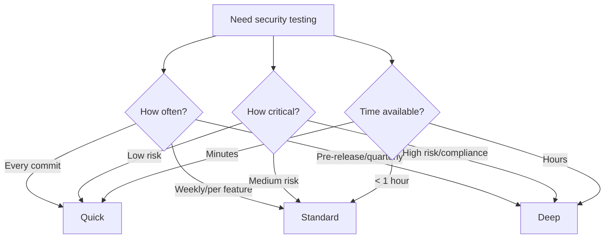

Strix offers three scan modes that control the depth, thoroughness, and speed of penetration testing. Choose the mode that best fits your use case.

## Overview

Set the scan mode with the `--scan-mode` or `-m` flag:

```bash
strix --target example.com --scan-mode <mode>
```

Available modes:
- **quick** - Fast CI/CD checks
- **standard** - Routine security testing
- **deep** - Thorough security reviews (default)

## Quick Mode

```bash
strix --target example.com --scan-mode quick
```

### Characteristics

<ParamField path="Speed" type="characteristic">
  Fastest execution time, typically completing in 5-15 minutes for small to medium applications.
</ParamField>

<ParamField path="Coverage" type="characteristic">
  Basic vulnerability coverage focusing on common, high-impact issues:
  - SQL injection
  - XSS (Cross-Site Scripting)
  - Authentication bypass
  - Critical misconfigurations
</ParamField>

<ParamField path="Depth" type="characteristic">
  Surface-level testing with limited exploration:
  - Fewer endpoints tested
  - Minimal fuzzing iterations
  - Basic static analysis
  - Limited agent spawning
</ParamField>

<ParamField path="LLM Configuration" type="characteristic">
  Optimized for speed:
  - Reduced reasoning effort
  - Fewer iterations per agent
  - Faster decision-making
</ParamField>

### Best For

- **Commit checks** - Quick validation of code changes
- **Pull request gates** - Fast feedback during code review
- **Development builds** - Rapid security checks during active development
- **Continuous Integration** - Daily or per-commit automated scans
- **First-pass screening** - Initial triage before deeper testing

### Example Use Cases

```bash
# Quick PR check
strix --target ./feature-branch --scan-mode quick --non-interactive

# Fast API endpoint test
strix --target https://api.example.com --scan-mode quick

# CI pipeline integration
strix --target . --scan-mode quick --instruction "Focus on authentication" --non-interactive
```

### Trade-offs

**Advantages:**
- Fast feedback loop
- Lower LLM API costs
- Suitable for frequent runs
- Good signal-to-noise ratio

**Limitations:**
- May miss complex vulnerabilities
- Limited code path coverage
- Fewer attack vectors explored
- Less thorough static analysis

## Standard Mode

```bash
strix --target example.com --scan-mode standard
```

### Characteristics

<ParamField path="Speed" type="characteristic">
  Balanced execution time, typically completing in 15-45 minutes for small to medium applications.
</ParamField>

<ParamField path="Coverage" type="characteristic">
  Comprehensive vulnerability coverage including:
  - All OWASP Top 10 categories
  - Business logic flaws
  - Authorization issues (IDOR, privilege escalation)
  - Session management vulnerabilities
  - API security issues
  - Sensitive data exposure
</ParamField>

<ParamField path="Depth" type="characteristic">
  Thorough testing with reasonable exploration:
  - Most endpoints tested
  - Multiple fuzzing strategies
  - Comprehensive static analysis
  - Moderate agent spawning
</ParamField>

<ParamField path="LLM Configuration" type="characteristic">
  Balanced configuration:
  - Standard reasoning effort
  - Good iteration depth
  - Thoughtful decision-making
</ParamField>

### Best For

- **Weekly security scans** - Regular security health checks
- **Feature branch testing** - Testing new features before merge
- **Staging environment audits** - Pre-production security validation
- **Regular security reviews** - Periodic assessment of running applications
- **Bug bounty preparation** - Initial testing before public programs

### Example Use Cases

```bash
# Weekly security check
strix --target https://staging.example.com --scan-mode standard

# Feature branch review
strix --target ./new-feature --target https://staging.example.com --scan-mode standard

# Regular API audit
strix --target https://api.example.com --scan-mode standard --instruction-file ./api-test-cases.md
```

### Trade-offs

**Advantages:**
- Good balance of speed and depth
- Comprehensive OWASP coverage
- Reasonable LLM costs
- Suitable for regular use

**Limitations:**
- May not catch subtle vulnerabilities
- Limited time for complex attack chains
- Moderate resource consumption

## Deep Mode (Default)

```bash
strix --target example.com --scan-mode deep
# or simply:
strix --target example.com
```

### Characteristics

<ParamField path="Speed" type="characteristic">
  Thorough execution, typically completing in 45 minutes to 2+ hours depending on application complexity.
</ParamField>

<ParamField path="Coverage" type="characteristic">
  Maximum vulnerability coverage:
  - All vulnerability types
  - Complex attack chains
  - Subtle business logic flaws
  - Advanced exploitation scenarios
  - Deep code analysis
  - Complete API surface testing
</ParamField>

<ParamField path="Depth" type="characteristic">
  Exhaustive testing with maximum exploration:
  - All discovered endpoints tested
  - Extensive fuzzing campaigns
  - Deep static and dynamic analysis
  - Aggressive agent spawning
  - Multi-step attack scenarios
</ParamField>

<ParamField path="LLM Configuration" type="characteristic">
  Maximum capability:
  - High reasoning effort
  - Deep iteration depth (up to 300 iterations)
  - Thoughtful, methodical approach
  - Extended thinking time
</ParamField>

### Best For

- **Pre-release audits** - Final security validation before production
- **Compliance requirements** - Meeting security audit standards
- **Security certifications** - Preparation for SOC 2, ISO 27001, etc.
- **Critical applications** - High-value or sensitive systems
- **Initial security baseline** - Comprehensive first assessment
- **Bug bounty programs** - Finding everything before researchers do

### Example Use Cases

```bash
# Pre-production audit
strix --target ./source-code --target https://staging.example.com --scan-mode deep

# Comprehensive security review
strix --target https://app.example.com --scan-mode deep --instruction-file ./security-requirements.md

# White-box audit for compliance
strix --target https://github.com/company/critical-app --target https://prod.example.com --scan-mode deep
```

### Trade-offs

**Advantages:**
- Most thorough security coverage
- Finds complex vulnerabilities
- Best for critical applications
- Comprehensive reporting

**Limitations:**
- Longest execution time
- Higher LLM API costs
- Significant resource usage
- Not suitable for frequent runs

## Comparison Table

| Feature | Quick | Standard | Deep |
|---------|-------|----------|------|
| **Typical Duration** | 5-15 min | 15-45 min | 45-120+ min |
| **OWASP Top 10 Coverage** | Partial | Complete | Complete+ |
| **Code Analysis Depth** | Basic | Thorough | Exhaustive |
| **Fuzzing Iterations** | Low | Medium | High |
| **Agent Spawning** | Minimal | Moderate | Aggressive |
| **Max Iterations per Agent** | ~50 | ~150 | ~300 |
| **Reasoning Effort** | Low | Medium | High |
| **API Cost** | $ | $$ | $$$ |
| **Best Use Case** | CI/CD | Regular testing | Pre-release |

## How Scan Modes Work

### LLM Configuration

Each scan mode configures the LLM differently:

```python
# Internal configuration (simplified)
quick_config = {
    "max_iterations": 50,
    "reasoning_effort": "low",
    "agent_spawn_threshold": "high"
}

standard_config = {
    "max_iterations": 150,
    "reasoning_effort": "medium",
    "agent_spawn_threshold": "medium"
}

deep_config = {
    "max_iterations": 300,
    "reasoning_effort": "high",
    "agent_spawn_threshold": "low"
}
```

### Agent Behavior

**Quick Mode Agents:**
- Focus on high-probability vulnerabilities
- Make faster decisions with less exploration
- Spawn fewer specialized sub-agents
- Terminate earlier when no obvious issues found

**Standard Mode Agents:**
- Balance speed and thoroughness
- Explore multiple attack vectors
- Spawn sub-agents for specialized tasks
- Continue testing until reasonable coverage

**Deep Mode Agents:**
- Exhaustively explore all possibilities
- Chain multiple attack techniques
- Spawn many specialized sub-agents
- Continue until maximum iterations or complete coverage

## Choosing the Right Mode

### Decision Flow



### Guidelines

**Use Quick when:**
- You need fast feedback (< 15 minutes)
- Testing code changes frequently
- Running in CI/CD pipelines
- Doing initial vulnerability screening
- LLM API costs are a concern

**Use Standard when:**
- You need balanced coverage
- Testing new features or releases
- Running weekly/monthly security scans
- Preparing for internal security reviews
- You have 30-60 minutes available

**Use Deep when:**
- You need maximum security assurance
- Preparing for production release
- Meeting compliance requirements
- Application handles sensitive data
- You have 1+ hours available
- Cost is less important than thoroughness

## Combining with Other Options

### Quick + Non-Interactive (CI/CD)

```bash
strix --target . --scan-mode quick --non-interactive
```

Fast, automated security gate for continuous integration.

### Standard + Instructions (Focused Testing)

```bash
strix --target example.com --scan-mode standard --instruction "Focus on API authorization"
```

Balanced scan with specific focus area.

### Deep + Multi-Target (Comprehensive Audit)

```bash
strix --target ./source --target https://staging.example.com --target https://prod.example.com --scan-mode deep
```

Thorough white-box testing across multiple environments.

## Performance Considerations

### Resource Usage

| Mode | CPU | Memory | Network | LLM API Calls |
|------|-----|--------|---------|---------------|
| Quick | Low | Low | Moderate | ~50-100 |
| Standard | Medium | Medium | High | ~150-300 |
| Deep | High | High | Very High | ~300-1000+ |

### Cost Estimation

LLM API costs vary by provider, but relative costs:

- **Quick**: $0.50 - $2 per scan
- **Standard**: $2 - $8 per scan
- **Deep**: $8 - $30+ per scan

<Note>
Actual costs depend on your LLM provider, model selection, and target complexity.
</Note>

## Advanced Configuration

While you can't directly configure scan mode parameters, you can influence behavior:

### Custom Instructions for Quick Mode

Make quick scans more focused:

```bash
strix --target example.com --scan-mode quick --instruction "Only test authentication endpoints for SQL injection and XSS"
```

### Environment Variables

Some environment variables affect all modes:

```bash
# Increase timeout for complex targets
export LLM_TIMEOUT=600

# Adjust reasoning effort (overrides mode defaults)
export STRIX_REASONING_EFFORT=xhigh

strix --target example.com --scan-mode standard
```

## Troubleshooting

### Scan Takes Too Long

**Problem**: Deep scan exceeds time budget

**Solutions**:
- Use standard or quick mode instead
- Provide focused instructions to limit scope
- Target specific endpoints rather than entire application

### Not Finding Expected Vulnerabilities

**Problem**: Quick scan misses known issues

**Solutions**:
- Use standard or deep mode for better coverage
- Provide specific instructions about where to look
- Run white-box testing with source code access

### High LLM Costs

**Problem**: Deep scans consuming too much API budget

**Solutions**:
- Use deep mode only for production releases
- Use standard mode for regular testing
- Use quick mode for CI/CD
- Consider local LLM models for cost reduction

## See Also

- [strix](/cli/strix) - Main command reference
- [Options](/cli/options) - All command-line options
- [Examples](/cli/examples) - Usage examples for each mode
- [Non-Interactive Mode](/cli/non-interactive-mode) - CI/CD integration
