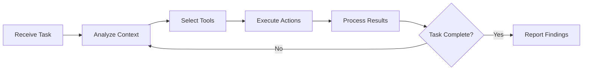

Strix is an autonomous penetration testing framework that combines AI agents, specialized security knowledge, and runtime sandboxing to discover vulnerabilities in your applications.

## Architecture Overview

At its core, Strix orchestrates multiple components working together:

<CardGroup cols={2}>
  <Card title="AI Agents" icon="brain">
    LLM-powered security experts that reason about targets and execute tests
  </Card>
  <Card title="Tools" icon="wrench">
    Specialized capabilities for terminal, browser, proxy, file manipulation
  </Card>
  <Card title="Skills" icon="book">
    Domain-specific security knowledge injected into agent context
  </Card>
  <Card title="Runtime" icon="container">
    Isolated sandboxes providing safe execution environments
  </Card>
</CardGroup>

## Execution Flow

When you start a scan, Strix follows this workflow:

### 1. Scan Initialization

Strix creates a root agent and initializes a sandbox environment:

```python
# From strix/agents/StrixAgent/strix_agent.py
async def execute_scan(self, scan_config: dict[str, Any]) -> dict[str, Any]:
    user_instructions = scan_config.get("user_instructions", "")
    targets = scan_config.get("targets", [])
    
    # Process different target types
    for target in targets:
        target_type = target["type"]
        if target_type == "repository":
            # Clone and analyze repositories
        elif target_type == "web_application":
            # Test web endpoints
```

The root agent receives:
- **Target information** (URLs, repositories, IP addresses)
- **User instructions** (custom testing requirements)
- **Sandbox workspace** (isolated environment with tools)

### 2. Agent Loop

Each agent operates in a continuous reasoning loop:



The agent loop handles:

<AccordionGroup>
  <Accordion title="Iteration Management">
    Each agent has a maximum iteration limit (default: 300) to prevent infinite loops. As the agent approaches the limit, it receives warnings to prioritize task completion.
    
    ```python
    # From strix/agents/base_agent.py
    if self.state.is_approaching_max_iterations():
        warning_msg = (
            f"URGENT: You are approaching the maximum iteration limit. "
            f"Current: {self.state.iteration}/{self.state.max_iterations}"
        )
        self.state.add_message("user", warning_msg)
    ```
  </Accordion>
  
  <Accordion title="State Management">
    Agent state tracks the full execution context:
    
    - `agent_id`: Unique identifier
    - `messages`: Conversation history with LLM
    - `actions_taken`: Tool invocations performed
    - `context`: Custom data storage
    - `errors`: Any failures encountered
    - `iteration`: Current loop iteration
  </Accordion>
  
  <Accordion title="Tool Execution">
    Tools execute either locally (in the Strix CLI) or remotely (in the sandbox):
    
    ```python
    # From strix/tools/executor.py
    async def execute_tool(tool_name: str, agent_state, **kwargs):
        execute_in_sandbox = should_execute_in_sandbox(tool_name)
        
        if execute_in_sandbox and not sandbox_mode:
            return await _execute_tool_in_sandbox(tool_name, agent_state, **kwargs)
        
        return await _execute_tool_locally(tool_name, agent_state, **kwargs)
    ```
  </Accordion>
</AccordionGroup>

### 3. Multi-Agent Coordination

Strix can spawn specialized sub-agents for complex tasks:

```python
# From strix/tools/agents_graph/agents_graph_actions.py
@register_tool
def create_agent(
    task: str,
    name: str,
    skills: str | None = None,
    inherit_messages: bool = False,
) -> dict[str, Any]:
    # Create new agent with specialized skills
    new_agent = StrixAgent(config={
        "state": new_state,
        "llm_config": llm_config,
    })
```

<Note>
Sub-agents share the same workspace and proxy history but maintain independent conversation contexts. This enables parallel testing while building on previous discoveries.
</Note>

### 4. Vulnerability Reporting

When agents discover security issues, they create structured reports:

```python
# From strix/tools/reporting/reporting_actions.py
@register_tool
def create_vulnerability_report(
    title: str,
    description: str,
    impact: str,
    target: str,
    technical_analysis: str,
    poc_description: str,
    poc_script_code: str,  # Required: actual exploit code
    remediation_steps: str,
    cvss_breakdown: str,
    endpoint: str | None = None,
    cve: str | None = None,
    cwe: str | None = None,
):
    # Validates CVSS metrics and creates report
    # Automatically checks for duplicate findings
```

Reports include:
- **CVSS scoring** (automatic calculation from metrics)
- **Proof-of-concept code** (executable exploit)
- **Duplicate detection** (prevents redundant findings)
- **Code locations** (vulnerable files and line numbers)

## Sandbox Architecture

<Info>
Strix sandboxes provide isolated environments where agents can safely execute commands, browse applications, and test for vulnerabilities without affecting your local system.
</Info>

Each sandbox includes:

- **Tool server**: HTTP API for executing tools (terminal, browser, file operations)
- **Caido proxy**: Intercepts and logs all HTTP/HTTPS traffic
- **Workspace**: Shared `/workspace` directory for code analysis
- **Isolated network**: Contained environment with controlled internet access

```python
# Sandbox initialization from strix/agents/base_agent.py
runtime = get_runtime()
sandbox_info = await runtime.create_sandbox(
    self.state.agent_id,
    self.state.sandbox_token,
    self.local_sources  # Upload local code to sandbox
)

self.state.sandbox_id = sandbox_info["workspace_id"]
self.state.sandbox_info = sandbox_info
```

## Agent Communication

Agents can send messages to each other for coordination:

```xml
<inter_agent_message>
  <sender>
    <agent_name>Auth Specialist</agent_name>
    <agent_id>agent_abc123</agent_id>
  </sender>
  <message_metadata>
    <type>information</type>
    <priority>high</priority>
  </message_metadata>
  <content>
    Found JWT token in localStorage: eyJhbGc...
    You can use this for authenticated endpoint testing.
  </content>
</inter_agent_message>
```

## LLM Integration

Strix supports multiple LLM providers with structured output:

- **Anthropic Claude**: Extended thinking, tool use
- **OpenAI GPT-4**: Function calling, structured responses  
- **Google Gemini**: Multi-modal analysis
- **OpenRouter**: Access to multiple models

```python
# From strix/agents/base_agent.py
async for response in self.llm.generate(self.state.get_conversation_history()):
    if response.tool_invocations:
        # Execute tools requested by LLM
        await process_tool_invocations(
            response.tool_invocations,
            conversation_history,
            self.state
        )
```

## State Persistence

Agent state is tracked throughout execution:

```python
# From strix/agents/state.py
class AgentState(BaseModel):
    agent_id: str
    agent_name: str
    parent_id: str | None = None
    sandbox_id: str | None = None
    
    task: str
    iteration: int = 0
    max_iterations: int = 300
    completed: bool = False
    
    messages: list[dict[str, Any]]  # Full conversation
    actions_taken: list[dict[str, Any]]  # Tool executions
    errors: list[str]  # Failures encountered
```

This enables:
- **Resume from interruptions**: Continue scans after pauses
- **Debugging**: Review full execution history
- **Analytics**: Track agent performance and behavior

## Next Steps

<CardGroup cols={2}>
  <Card title="Agents" icon="robot" href="/concepts/agents">
    Learn about agent types and capabilities
  </Card>
  <Card title="Tools" icon="hammer" href="/concepts/tools">
    Explore available tools and their usage
  </Card>
  <Card title="Skills" icon="graduation-cap" href="/concepts/skills">
    Understand the skills system
  </Card>
  <Card title="Vulnerability Detection" icon="shield" href="/concepts/vulnerability-detection">
    See how Strix finds security issues
  </Card>
</CardGroup>